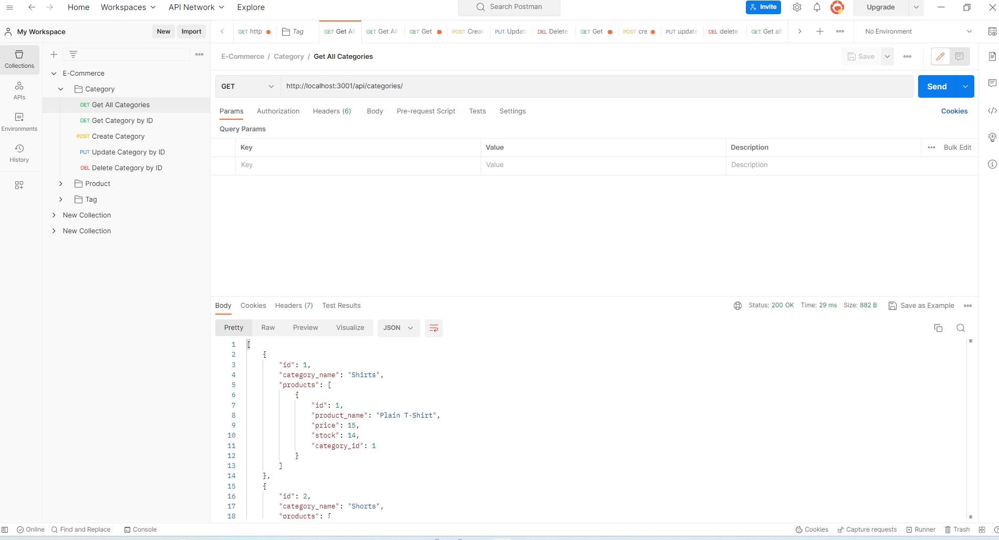
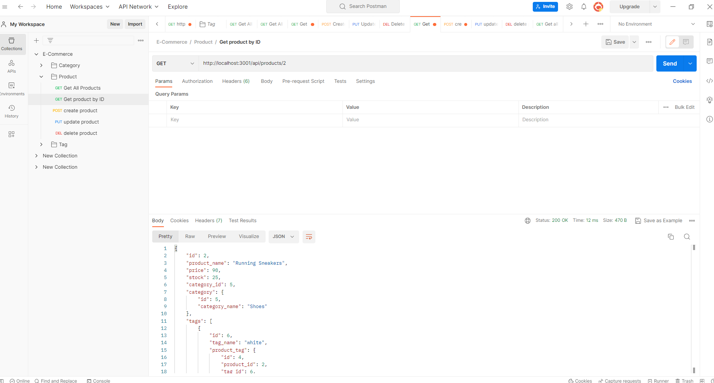
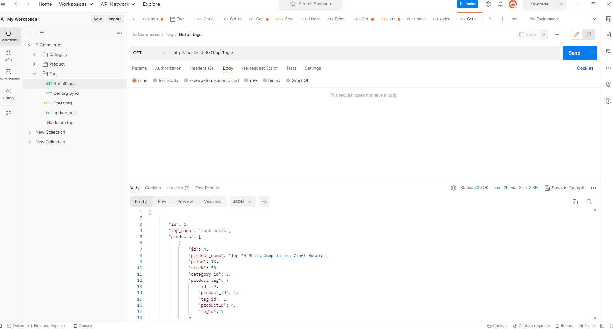

# E-Commerce

## Discription

this is my 13th assignment and it was creating a E-commerce in , Javascript,  SQL ,and node language

in this 13th assignment  i started with a given code 

-my motivation was to practice what i learned in the bootcamp untill April 23 2023

## usage
the website contain HTML, CSS, Javascript(front end & back end)and node language and has been pushed to github repostiry.

## screencastify link
https://drive.google.com/file/d/15Vwf2NGPaJgPWKrCfEFvuBRJcBT3axcq/view

**for better screencastify quality, please open it with video player for google drive on the top of the screen**

## github 
https://github.com/melhelow/E-Commerce

## Used technologies
Postman

## credits

bootcamp,tutor session

## License

please refer to the MIT license in the repo

